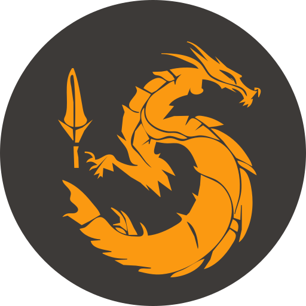

# Dragon Claw

## Description
Dragon Claw is a small remote control tool written in Rust and Dart (Flutter). It is mostly meant as a learning
experience and thus not suitable for anything super serious.

That being said, if you just want an App that can power-off or reboot your PC with zero configuration, this is for you.

## How it works
The Dragon Claw Agent is meant to be run as a system service on either Linux or Windows. Upon start, a random port is
chosen for a gRPC server to listen on. After a TCP listener has been bound, the associated port is broadcasted via
mDNS.

The Dragon Claw App is meant to be run on a mobile device. It will listen for mDNS broadcasts and display any found
Dragon Claw Agents. The user can then select an Agent and send commands to the agent.
